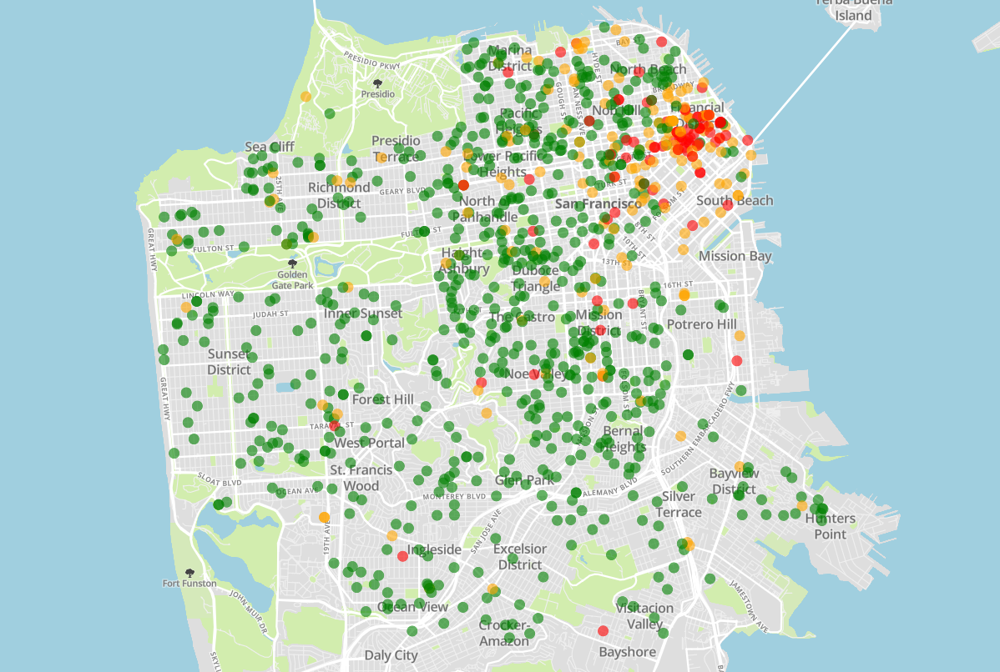

# San Francisco Fire Risk

## Summary
Cities are complicated. But perhaps we could get a decent picture by looking at how a city has changed - namely, by looking at the building modification permits that have been issued.

This project tries to use information from those permits to predict fire risk at addresses in San Francisco. 

## Data
Much of the information in these permits can be found in the descriptions. Most machine learning algorithms require numerical vectors as input, so I converted the descriptions using Tfidf - term frequency inverse document frequency. That is, each description was converted to a numerical vector where each element is the frequency of a word in the description, weighted by how rare the word is within all the descriptions. 

Word frequency is used over word counts to control for the fact that descriptions have different lengths, and the rarity scaling is meant to put priority on rare words which are more likely to differentiate descriptiosn. It's hard to conclude anything from a descrpition having the word "the", but words like "food" and "beverage" are strong indicators that the building may be a restaurant.

## Findings
Using those vectorized descriptions, I constructed a logistic regression model to predict whether or not a fire will happen at a building.

Logistic regression was chosen for two reasons: fitting speed and interpretability. 

The speed allowed rapid iteration through ideas, and since all my input data was scaled to be between 0 and 1, coefficients can be interpreted as how much a word increases the odds of having a fire. 

With this model, the ROC-AUC score was 0.812

This can be interpreted as "the chance a random positive case has a higher fire risk rating than a random negative case"

Here is a plot of predictions, on top of a map of San Francisco. Each point represents a permit, and the color represents the predicted likelihood that a fire will occur at that location after the permit is issued.

| Word	| Fire Risk
|:------|:--------
| bart 	| 0.8117647058823529
| mall 	| 0.18647281921618206
| kiosk 	| 0.5945945945945946
| hospital 	| 0.44
| laminate 	| 0.27149321266968324
| damage 	| 0.07406935237123917
| aurora 	| 0.9285714285714286
| tower 	| 0.37277486910994767
| generator 	| 0.40380549682875266
| hotel 	| 0.3575
| bart 	| 0.8117647058823529
| mall 	| 0.18647281921618206
| kiosk 	| 0.5945945945945946
| hospital 	| 0.44
| laminate 	| 0.27149321266968324

|Word       | 	increase 	|same 	|decrease 	|ir
|:-----------|:--------|:----------|:---------|:-----------
|maher 	|17946 	|18404 	|1464 	|12.258197
|traps 	|454 	|95 	|8 	|56.750000
|apt 	|3152 	|6321 	|759 	|4.152833
|ref 	|12313 	|18399 	|1950 	|6.314359
|deferred 	|441 	|655 	|69 	|6.391304
|mep 	|3201 	|2616 	|614 	|5.213355
|ordinance 	|5046 	|6602 	|610 	|8.272131
|exh 	|1113 	|1421 	|326 	|3.414110
|general 	|66271 	|313753 	|43075 	|1.538503

## Other
Building modification descriptions can be grouped into topics.

Using NMF, we can get representative words for any number of automatically created topics. In this case, 6 topics seemed to cover a variety of building modification types, without creating redundant or nonsensical topics.

|Topic   |  Words                                                                | Fire risk
|:-------|:----------------------------------------------------------------------|:-----------
|1       | family, dwelling, reroofing, roofing, renew, report                   | .0286
|2       | replace, new, kitchen, remodel, window, bathroom                      | .0614
|3       | apartment, reroofing, soft, appendix, unit, chapter, retrofit, story, | .1363
|4       | office, ref, floor, fire, sprinkler, relocate, alarm                  | .3572
|5       | work, final, inspection, obtain, approved, complete, under, all       | .1146
|6       | food, beverage, hndling, retail, sale, fire, sign, system, new        | .2175

In this table, the fire risk is the proportion of permits classified under a given topic where a fire happened at that address after the permit was issued.

The lowest fire risks were in topics 1 and 2. Based on the representative words, these are permits for homes for single families. Compared to other topics, these buildings likely have far fewer people, and thus fewer chances for someone to make a mistake.

## Future
Early data exploration indicated that the height of a building was quite helpful in predicting fire risk. Unfortunately, this was not available in my training data from before 2015. If this project were to be repeated in the future, better predictions could be attained using that data.

Building permit application evaluation:
Will this modification increase fire risk?

San Francisco Fire Predictions
Description:
Predict fire incidents using information about buildings, from permit applications, with the goal of finding relationships between certain types of applications and fires. Alternatively, simply predict areas in the city more prone to fire. 
Presentation: 
 Slides, talking about predictive power of my model. Show off a map of current threat.
Next steps:
Look into other types of building related incidents, or alternatively, look for different predictors of fire.

Techniques:
    I have multiple csv’s: one for fire incidents, and one for each month of building permits. I’ll     need to combine rows from the different building permit datasets, and then link fire 
incidents to building permits by address. 

For address matching, it seems that a simple split will generally results in a group 
(address #, street name[, other words in the street name], street type abbreviation).
 If I lowercase things, and remove punctuation, matching should be pretty consistent.

Afterward, I’ll need to featurize descriptions of permits and fire incidents. I could start with tfidf or counts, and maybe look for other techniques later.

Potential Problems:
    There are quite a few factors to consider. 

    I’ll need to keep good track of dates, and account for permits filed after a fire; in these 
cases, the building changes obviously played no part in the fire. 

I’ll also need to consider how much time has passed since a permit was issued, in order 
to contextualize the significance of fire incidents that occur afterward. After all, a building 
that goes 10 years after a change without a fire is likely more significant than one that has 
no fires after a month. To start, I could choose a fixed time period after building permits to 
analyze, but I may consider more elegant solutions.

It may also be a challenge to split my data for validation. I believe the best solution for 
now would be to choose some addresses (and all associated fires) as a test set, though 
that could make it troublesome if I want to find effects of building changes on nearby buildings.

There is the possibility of illegal building changes without permits. Intuitively, these might be even more related to fires than legal changes. I will need to carefully consider what effects this might have on my results. 
Scope:
    To start, I plan to investigate the relation between descriptions of building permits issued 
and fire incidents in the same building. 

More specifically, I’ll start with predicting likelihood of fire within 5 years after a permit is 
issued, based on the description of the permit, existing and proposed use of the building, and numerical information like proposed and existing stories in the building.

By the end of the project, I plan to find a better way to express “likelihood” of a fire, accounting for multiple permits for the same building and details like frequency of fires, fires after 5 years, and more.

If time permits, I also plan to try and examine effects of building changes on fires near the building, rather than just fires in the same building. 
Resources:
    Planning to use sklearn, nltk, numpy, pandas. Possibly plotly, tensorflow if neural 
networks seem like a good idea.

Data is linked below.

Credits will be included.
    

Data:
Target: Fire incidents in San Francisco
https://data.sfgov.org/Public-Safety/Fire-Incidents/wr8u-xric
    Predictors: Building permit filings
https://sfdbi.org/building-permits-filed-and-issued

Code to download the building permit filings is at https://github.com/porbo/sf-fires/src/download_data.py

US Census Bureau api for geocoding: https://www.census.gov/geo/maps-data/data/geocoder.html

citing sklearn
https://scikit-learn.org/stable/about.html#citing-scikit-learn

citing nltk
https://groups.google.com/forum/#!topic/nltk-users/CS2fCFxvu1I

https://help.plot.ly/citations/

https://developers.google.com/machine-learning/crash-course/classification/roc-and-auc
