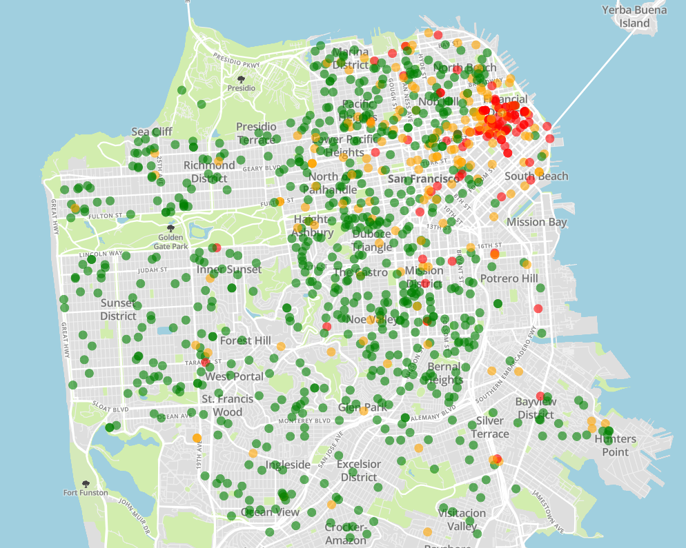
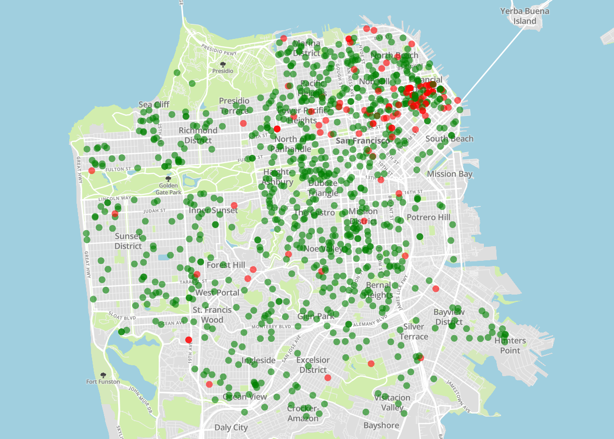

# San Francisco Fire Risk

## Summary
Cities are complicated. But perhaps we could get a decent picture by looking at how a city has changed - namely, by looking at the building modification permits that have been issued.

This project tries to use information from those permits to predict fire risk at addresses in San Francisco. 

## Data
Much of the information in these permits can be found in the descriptions. Most machine learning algorithms require numerical vectors as input, so I converted the descriptions using Tfidf - term frequency inverse document frequency. That is, each description was converted to a numerical vector where each element is the frequency of a word in the description, weighted by how rare the word is within all the descriptions. 

Word frequency is used over word counts to control for the fact that descriptions have different lengths, and the rarity scaling is meant to put priority on rare words which are more likely to differentiate descriptiosn. It's hard to conclude anything from a descrpition having the word "the", but words like "food" and "beverage" are strong indicators that the building may be a restaurant.

## Findings
Using those vectorized descriptions, I constructed a logistic regression model to predict whether or not a fire will happen at a building.

Logistic regression was chosen for two reasons: fitting speed and interpretability. 

The fitting speed allowed rapid iteration through ideas.

And with logistic regression, when the features have the same scale, we can look at the magnitude of coefficients as an indication of how helpful that word's prescence is in predicting fire risk. 

Below is a chart of words, and the percentage of permits containing that word after which a fire occurred.

| Word	| Fire Risk
|:------|:--------
| bart 	| 0.8118
| mall 	| 0.1865
| kiosk 	| 0.5946
| hospital 	| 0.44
| laminate 	| 0.2715

For reference, the overall "Fire Risk" was about 13%. 

As we can see, some words indicated a much higher fire risk. In general, the model seems to be good at finding places with lots of people (indicated by words like mall, hospital, bart) - after all, more people means more chance that something goes wrong.

### Model performance

With this model, the ROC-AUC score was 0.812

This can be interpreted as "the chance a random positive case has a higher fire risk rating than a random negative case"

Here is a plot of predictions, on top of a map of San Francisco. Each point represents a permit, and the color represents the predicted likelihood that a fire will occur at that location after the permit is issued.

And for reference, here is a plot of those same locations with color representing whether a fire actually happened there.

The model was trained using permits and fires occuring before 2015. The plots were made using a random sample of permits issued in 2015, and fires occuring up until February 2019. 

The separation of train and test data is standard to give a more accurate idea of how well the model makes true predictions about the future. The test set was chosen a few years ago so we can more accurately gauge fire risk - if we tested using permits issued in 2019, for instance, there is simply not enough time to see if a fire happened afterward.

### Exploring increases in fire risk over time

I also tried to see if there were perhaps building modifications that cause an increase in fire risk. 

This was done by using the same model, but switching the target from "was there a fire here afterward?" to "did fires per year increase after the permit was issued?"

Below is a table of the words with highest coefficient in that model, along with counts of permits where the fires per year increased, stayed the same, and decreased.

"general" refers to the total counts, without filtering for any words.

|Word       | 	increase 	|same 	|decrease 
|:-----------|:--------|:----------|:---------
|maher 	|17946 	|18404 	|1464 	
|traps 	|454 	|95 	|8 	
|apt 	|3152 	|6321 	|759 	
|ref 	|12313 	|18399 	|1950 	
|deferred 	|441 	|655 	|69 	
|mep 	|3201 	|2616 	|614 	
|ordinance 	|5046 	|6602 	|610 	
|exh 	|1113 	|1421 	|326 	
|general 	|66271 	|313753 	|43075 	

Notes:

Maher refers to the Maher Ordinance, and is generally mentioned to say something like "compliance with the maher ordinance is not necessary".

Traps refers to p-traps, which are placed under sinks to trap waste water.

ref indicates a reference to another permit.

MEP stands for Mechanical, Electrical, Plumbing

One thing to note is that many of these words could help indicate the age of the building. For example, replacing p-traps is a sign that the building is old enough for them to wear out. This is interesting since building age is not readily available information.

## Other
Building modification descriptions can be grouped into topics.

Using NMF, we can get representative words for any number of automatically created topics. In this case, 6 topics seemed to cover a variety of building modification types, without creating redundant or nonsensical topics.

|Topic   |  Words                                                                | Fire risk
|:-------|:----------------------------------------------------------------------|:-----------
|1       | family, dwelling, reroofing, roofing, renew, report                   | .0286
|2       | replace, new, kitchen, remodel, window, bathroom                      | .0614
|3       | apartment, reroofing, soft, appendix, unit, chapter, retrofit, story, | .1363
|4       | office, ref, floor, fire, sprinkler, relocate, alarm                  | .3572
|5       | work, final, inspection, obtain, approved, complete, under, all       | .1146
|6       | food, beverage, hndling, retail, sale, fire, sign, system, new        | .2175

In this table, the fire risk is the proportion of permits classified under a given topic where a fire happened at that address after the permit was issued.

The lowest fire risks were in topics 1 and 2. Based on the representative words, these are permits for homes for single families. Compared to other topics, these buildings likely have far fewer people, and thus fewer chances for someone to make a mistake.

## Future
Early data exploration indicated that the height of a building was quite helpful in predicting fire risk. Unfortunately, this was not available in my training data from before 2015. If this project were to be repeated in the future, better predictions could be attained using that data.

## Obstacles and lessons
Over the course of the project, I ran into many obstacles. This space will chronicle some of them.

### Data
The building permit data came as monthly data. In order to combine them, I needed to fix column names, since different months used different names for the sample column (e.g. existingstories vs. existing_stories vs. existing stories). To solve this, I looked at all the unique column names, picked one name for each column, and mapped the names in monthly data accordingly before merging.

Also, all the data in March 2004 was shifted one column over from the names. This took a while to diagnose.

The data on fire incidents had an issue in that it included everything the fire department did, including non-fire incidents. Thankfully, the fire departments includes well-organized situation codes for all incidents. All actual fire incidents had a code starting with '1', so I simply filtered out everything else.

### Data processing
After, I needed to match fire incidents to permits by address. This was a challenge since the fire incidents didn't have a standard address format. Sometimes it would end in 'Street', sometimes 'st', sometimes it would have an apartment number afterward. I ended up matching by starting with the addresses in building permit applications (which were well formatted), and checking if the street number and street name matched the first characters of the fire incident address. 

I eventually geocoded the addresses in building permit applications, so I could potentially match using location. I'd expect this to be more reliable, but unfortunately, I did not have the latitude/longitude in time to try this. 

I also ran into computational time issues with the matching. For every unique address (over 100,000), I needed to find the fires (out of 60,000) that happened at that location and count them, while also checking and recording if the fires happened before or after the permit's issue. I spent some time trying to solve this, but after I got the total estimated time down to below a few hours (checking how fast the first few thousand attempts ran) I decided to simply run the process on AWS EC2 and work on other things in the meantime. I imagine that I'd have to come up with a better address matching method to truly improve the speed. 

On another note, trying to geocode 100,000 addresses was something of a challenge. Services like https://www.findlatitudeandlongitude.com/batch-geocode/ specifically do not want to allow that many requests. 100,000 addresses is also rather expensive with paid api's. I eventually found US Census Bureau's geocoding api, which got me my locations after running overnight on EC2.

### Modeling performance
One thing I noted earlier is that I had to use 2015 permits as my test set, in the process ignoring all the permits issued later. This was necessary to have a worthwhile test set, since we need time to really see if a fire will occur. If possible, I'd have liked even more time to see if a fire would occur, but I felt I was throwing away too much permit data. I was already losing information on building height that only exists in more recent permits. Basically, I wish I had more years of data. 

## Sources
### Data
Fire Incidents: https://data.sfgov.org/Public-Safety/Fire-Incidents/wr8u-xric
Building permit filings: https://sfdbi.org/building-permits-filed-and-issued

### Tools
US Census Bureau api for geocoding: https://www.census.gov/geo/maps-data/data/geocoder.html

[Scikit-learn: Machine Learning in Python](http://jmlr.csail.mit.edu/papers/v12/pedregosa11a.html), Pedregosa et al., JMLR 12, pp. 2825-2830, 2011.

NLTK: Bird, Steven, Ewan Klein, and Edward Loper (2009), Natural Language
Processing with Python, O'Reilly Media.

Author: Plotly Technologies Inc. Title: Collaborative data science Publisher: Plotly Technologies Inc. Place of publication: Montréal, QC Date of publication: 2015 URL: https://plot.ly

### Information
https://developers.google.com/machine-learning/crash-course/classification/roc-and-auc
